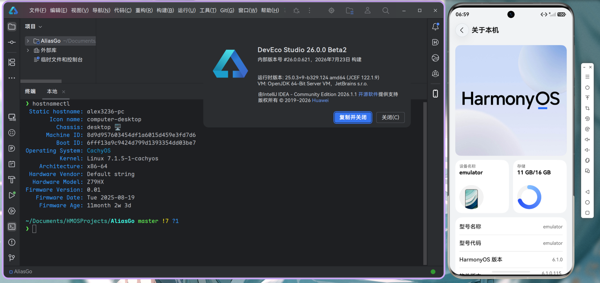

# DevEco Studio — Linux PKGBUILD

**English** | [`中文`](README_CN.md)

  

Thanks to [Cris.Q](https://crisq.top/blog/deveco_linux_porting_notes) for the original porting notes that inspired this project.

This is an Arch Linux PKGBUILD that packages DevEco Studio (Huawei's IDE for HarmonyOS development) from its Mac DMG distribution, bringing it to Linux with the help of JetBrains' IntelliJ IDEA native launcher and JBR.

It is not an official package. It is not endorsed by Huawei or JetBrains.

## Status

Everything works except the previewer. If you find any problems, file an issue.

If Huawei ships a native Linux build, this project will be archived.

> [!NOTE]  
> If you plan to use this project, reading the full README is strongly recommended; the collapsed sections are optional reading as needed.

## Building

Always check `PKGBUILD` yourself before using.

<b>I want to build locally</b>

 <table><thead><tr><td>

Download two files from Huawei's website:

1. **DevEco Studio ${pkgver} for Mac**
2. **Command Line Tools for Linux (x86_64) ${pkgver}**

Place both `.zip` files next to the PKGBUILD, **renamed** to `devecostudio-mac.zip` and
`commandline-tools-linux-x64.zip`.

Then:

    # Clone the repo
    git clone https://github.com/alex3236/devecostudio-linux.git
    cd devecostudio-linux

    # Checkout latest tag (skip if you accept untested changes)
    git fetch --tags
    git checkout $(git describe --tags $(git rev-list --tags --max-count=1))
    
    # Building
    makepkg -si

If you find checksum errors, it means Huawei has updated the IDE, and you will need to test for yourself whether this project still works.

To update checksums to match your local files:

    updpkgsums

</td></tr></thead></table>

<b>I don't have an Arch machine, or I want to build online</b>

 <table><thead><tr><td>

If you don't have an Arch machine at hand, the same build can be run in
GitHub Actions:

1. **Fork** this repository.
2. Open the **Actions** tab, select **Build DevEco Studio PKGBUILD** and click **Run workflow**.
3. Optionally, "Use workflow from" a tagged release.
4. Fill in the two download URLs:
   - `mac_zip_url` — URL of the Mac zip
   - `cli_zip_url` — URL of the Linux Command Line Tools zip
5. Optionally override the version and checksums (leave empty to keep the values in `PKGBUILD`):
   - `pkgver` — e.g. `6.1.1.280`
   - `mac_zip_sha256` / `cli_zip_sha256` — SHA256 of the two zips; use `SKIP` to skip verification for an untested version
6. When the run finishes, download the `devecostudio-pkg` artifact from the run page and install it locally:

       sudo pacman -U devecostudio-*.pkg.tar.zst

A GitHub account can use Actions for free on public repositories.

</td></tr></thead></table>

<b>I need to use this project on other distributions</b>

 <table><thead><tr><td>

Build online. It produces a distro-agnostic tarball
(`devecostudio-<ver>-linux-x86_64.tar.gz`).

On Debian/Ubuntu/Fedora or any other Linux, extract it and set up the launcher
manually:

    sudo tar -xzf devecostudio-<ver>-linux-x86_64.tar.gz -C /opt
    sudo ln -s /opt/devecostudio/bin/devecostudio.sh /usr/local/bin/devecostudio
    sudo desktop-file-install /opt/devecostudio.desktop

You also need the runtime dependencies (package names vary by distro):
`libxss`, `libxtst`, `nss`, `alsa-lib`, `libxcrypt-compat`, `freetype2`,
`libpulse`. Chinese input support needs `fcitx5`. Unlike the Arch package,
the bundled CLI tools are not linked into `/usr/bin` — call them by full
path under `/opt/devecostudio/tools/bin/`.

Of course, you can also use other methods you prefer, such as running 
Arch in a container for building.

</td></tr></thead></table>

## Usage

Launch DevEco Studio with whatever you are familiar with (start menu / dock / command line).

### CLI tools on PATH

The IDE needs the bundled Huawei command-line tools at runtime, and they
also work standalone from a terminal. By default the package symlinks them
into `/usr/bin`:

- Always exposed: `devecostudio`, `hdc`
- Exposed by default: `hvigorw`, `ohpm`, `hstack`, `hcodelinter`, `hemulator`;

`Emulator` and `codelinter` are prefixed to avoid possible collisions.

<b>Adjusting the symlink behavior</b>

 <table><thead><tr><td>

Both behaviors are controlled by variables at the top of the PKGBUILD:

- `_expose_cli_tools=true`
    - If set to `false`, the by-default exposed commands are not symlinked into `/usr/bin`
    - They are still callable by full path under `/opt/devecostudio/tools/bin/`
- `_hprefix_generic_tools=true`
    - If set to `false`, no `h` prefix is added; `codelinter` and `Emulator` are exposed under their original names

</td></tr></thead></table>

### Emulator

The emulator works, but before first use you must accept the software
agreements and download the system images via the command line.

<b>How?</b>

 <table><thead><tr><td>

    # List available images
    hemulator -imageList

    # Phone images only
    hemulator -imageList -deviceType phone

    # Use jq for a concise list
    hemulator -imageList -deviceType phone | jq '.[].osVersion'

    # Install an image
    hemulator -install -deviceType phone -osVersion "HarmonyOS 6.1.1(24)"

Once installed, you can create, manage and start emulators from the
IDE's Device Manager.

</td></tr></thead></table>

### DevEco CLI

With Huawei's DevEco CLI, you and your AI Agent can effortlessly handle project initialization, building, signing, and debugging, alongside documentation lookup.

This project provide environment support for DevEco CLI. Simply set `DEVECO_CLI_STUDIO_PATH=/opt/devecostudio`.

### Previewer

The previewer is unavailable. Huawei has not yet ported the Rosen
rendering engine to Linux.

## How does this work?

The PKGBUILD extracts the Mac DMG and takes the platform-independent parts,
then replaces the macOS-specific bits (launcher, JBR, native libraries) with
their Linux counterparts from IntelliJ IDEA. The vmoptions and
product-info.json are transformed on the fly so the IDE knows it's running
on Linux.

The result is a native-feeling DevEco Studio that runs without Wine or
containers.

Why repackage from the Mac version? Huawei distributes DevEco Studio for
Windows, macOS, and Linux. The Linux distribution has two problems: the
installer is an `.exe` that is hard to extract, and the packaged version
lags behind in updates. The Mac DMG is trivially extractable and contains
all the cross-platform files we need.

<b>Component details</b>

<table><thead><tr><td>

### The emulator

Three emulator-related quirks deserve a mention.

First, Huawei's code only
distinguishes Mac from non-Mac, and the non-Mac branch hardcodes the
`Emulator.exe` filename. On Linux that file does not exist, which broke the
Device Manager and debugging. The package fixes this with a symlink:
`Emulator.exe -> Emulator` in `tools/emulator/`.

Second, system images must be downloaded manually because of how the
official installer works: when the emulator is missing, its wizard downloads
the binary *and* the system image together. Since this package bundles the
binary, the IDE thinks the emulator is installed and never offers the
wizard, leaving the system image as the only missing piece — see the
Emulator section above for how to get one.

Third, the emulator's software agreements: the IDE launches the emulator
binary directly, and if the agreements were never accepted it waits
silently for a `y`. The `Emulator` wrapper auto-accepts them on first use
(`hemulator ...` when `~/Library/Caches/Huawei/Emulator26.0/.emu_config`
does not exist runs `-license accept` and exits), so by the time you use
the IDE the agreements are in place. To opt out of the auto-accept,
truncate that `.emu_config` file.

### Wayland

Most of the IDE runs fine under Wayland, but the CEF-based user interfaces
— the project structure dialog, markdown preview, and similar — crash their
GPU process under Wayland (`eglCreateWindowSurface` segfault). The launcher
wrapper works around this by forcing the X11 backend by default
(`unset WAYLAND_DISPLAY`, `GDK_BACKEND=x11`), which makes every CEF page
render correctly through XWayland.

If you prefer to run under Wayland natively, set
`DEVECO_DISABLE_X11_WORKAROUND=1` before launching — but expect the CEF
pages to be blank or broken.

The launcher also enables JCEF's headless + out-of-process rendering by
default (equivalent to `ide.browser.jcef.headless.enabled` and
`ide.browser.jcef.out-of-process.enabled` in the registry), which fixes
blank CEF pages in some environments. Set `DEVECO_DISABLE_JCEF_HEADLESS=1`
before launching to opt out.

### HiDPI

XWayland does not report per-monitor scale to the JVM (it reports 1.0), so
on a HiDPI screen the IDE would lock its UI scale to 1.0 — too small. The
launcher reads the compositor's real scale (`wlr-randr`), rounds it to the
nearest quarter step, and injects it as `-Dide.ui.scale` via a user
vmoptions overlay.

Override the value or disable the detection:

    DEVECO_UI_SCALE=1.2 devecostudio   # use 1.2 as-is
    DEVECO_UI_SCALE=off devecostudio   # leave scaling to the JVM

You can also set the scale manually via the IDE's *Help → Edit Custom VM
Options*. For more, see [the IDEA HiDPI
documentation](https://intellij-support.jetbrains.com/hc/en-us/articles/360007994999-HiDPI-configuration).

</td></tr></thead></table>

For the sake of brevity, you can check [DETAILS.md](DETAILS.md) to learn about other magic used in this project.

## License situation

This project is not affiliated with or endorsed by Huawei.

<b>Terms, redistribution and component licenses</b>

 <table><thead><tr><td>

DevEco Studio is a commercial product owned by Huawei. Before using it, you agree to the HUAWEI DevEco Studio User Agreement (reproduced in LICENSE.huawei). A few clauses worth noting:

- **Clause 1.6** grants a "limited, non-exclusive, free, non-transferable, non-sublicensable, and revocable" license to use DevEco Studio solely for developing applications that run on OpenHarmony-compatible devices and/or HarmonyOS.
- **Clause 1.7(f)** prohibits copying or modifying the service, or merging any part of it with other programs.
- **Clause 1.7(h)** prohibits reverse engineering, decompiling, or creating derivative works.
- **Clause 1.7(i)** prohibits distributing, selling, or transferring the service.

This packaging project extracts platform-independent files from the Mac DMG and recombines them with Linux-native components (launcher, JBR, native libraries) from IntelliJ IDEA. The Java bytecode and resources are not modified, but configuration files are transformed. This likely constitutes "modification" and "merging" under clauses 1.7(f) and 1.7(h).

What this means in practice:
- Building this package for personal use is what the author does, and the project exists to document that process.
- Distributing the resulting package to others is likely not permitted under Huawei's terms.
- If you have legal concerns, consult Huawei's official licensing at https://developer.huawei.com/consumer/cn/deveco-studio/ and your own legal counsel.

### Licensing of the packaging scripts

The files that make up this packaging project are provided under the BSD 2-Clause license.

They are not part of DevEco Studio and carry no restrictions from Huawei's terms.

### Licensing of bundled components

- DevEco Studio itself and its plugins are proprietary works of Huawei.
- JetBrains Runtime (JBR) is GPLv2 with the classpath exception, based on OpenJDK.
- IntelliJ IDEA Community components are available under Apache 2.0.
- Various third-party libraries bundled with DevEco Studio carry their own licenses.

</td></tr></thead></table>

